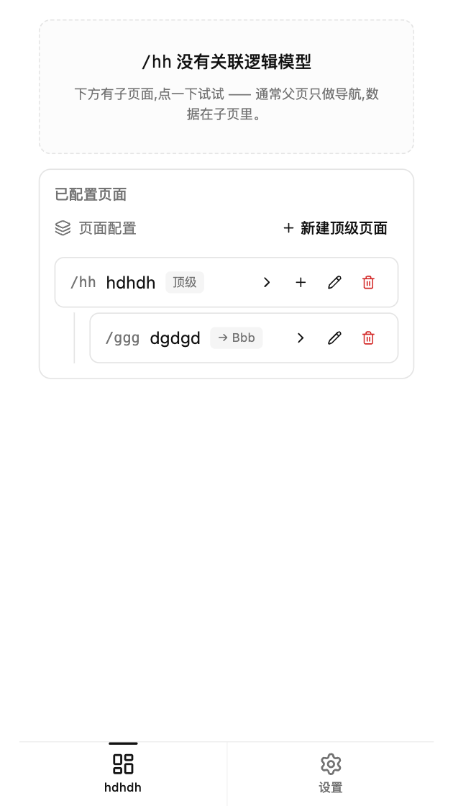
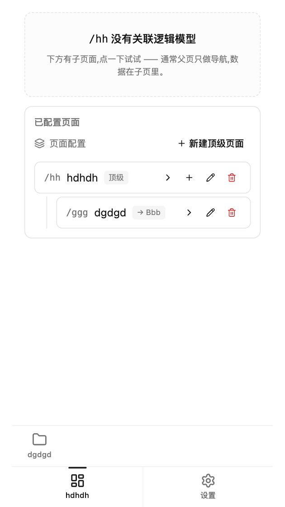
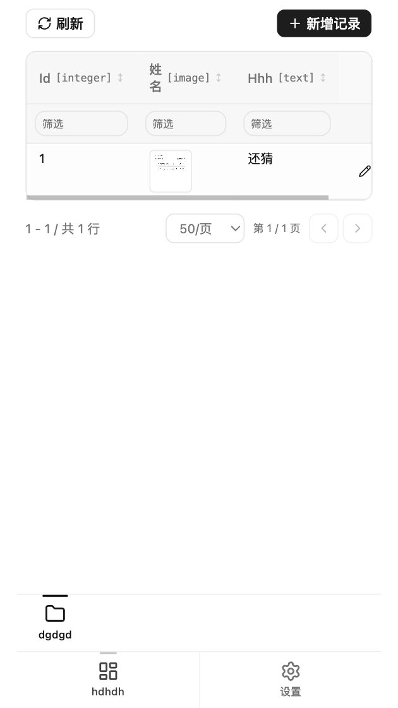
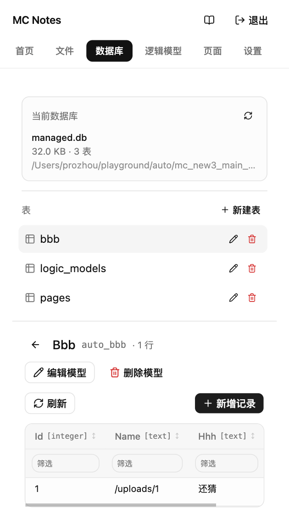
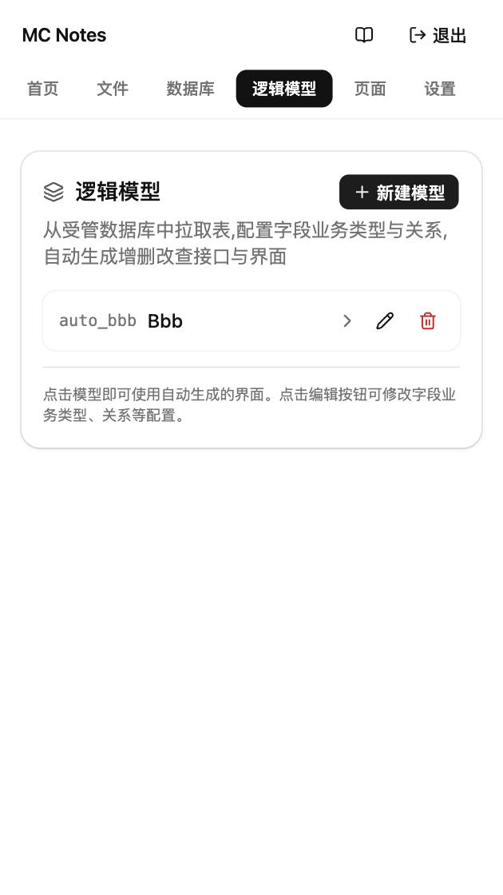
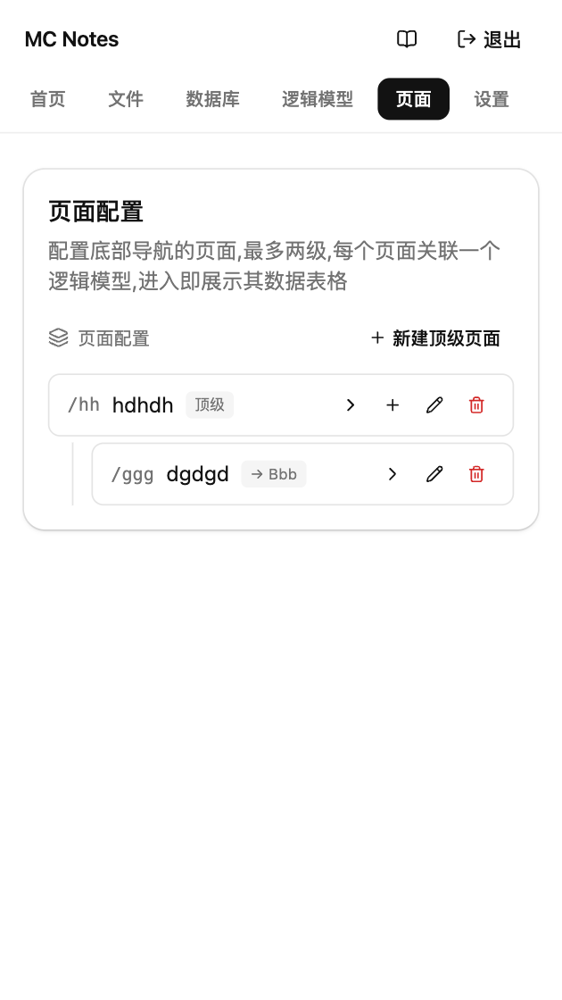
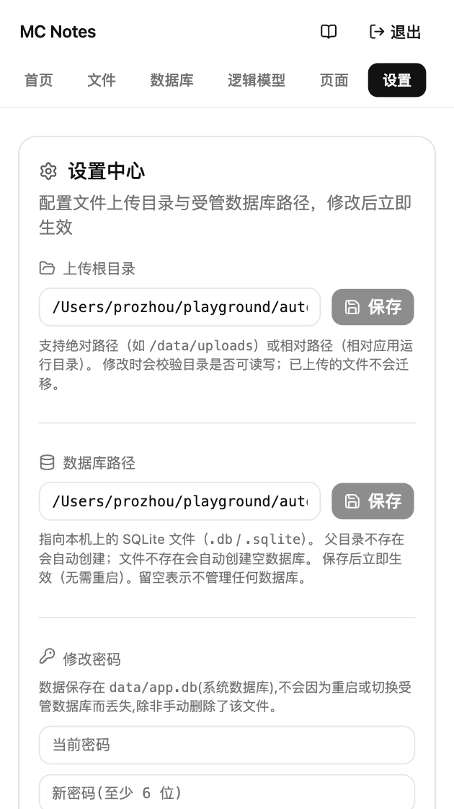

# MC Notes

一套自托管的「数据库 + 逻辑模型 + 页面」一体化工具：先把 SQLite 表建好，再配置字段业务类型，最后让页面直接展示对应表的数据 —— 全程通过 Web 完成，不写一行后端代码。



## 主要特性

- **首页（移动优先）**：底部 Tab 展示一级页面，点亮后上方露出二级子页面，左对齐、样式与一级菜单一致。
  
- **运行时数据**：每个关联了逻辑模型的页面，自动获得增删改查表格、筛选、分页、上传字段。
  
- **数据库管理**：左侧表列表，右侧实时 CRUD，支持新建表、修改表结构（增删列）。
  
- **逻辑模型**：从受管数据库拉取表，配置字段业务类型 / 关系，自动生成 `/api/runtime/:slug` 路由和前端表格。
  
- **页面配置**：两级页面、图标、排序、关联模型，一站式管理底部导航。
  
- **用户与角色**：超级管理员与普通用户分表管理；角色绑定功能权限；按角色决定可见的 Tab 与可执行的操作。
- **设置中心**：上传根目录 / 受管 SQLite 路径热更新；修改密码；Swagger UI 跳转。
  
- **日志模块（外部写入）**：面向外部系统暴露 `POST /api/logs`（Bearer Token 或 Session Cookie），调用方主动推送日志；Web UI 在线检索、过滤、分页、附带截图预览。**不会**自动记录本服务自身请求。
  

## 快速开始

环境：Go 1.25+、Node.js 20+、macOS/Linux。

### 一键本地开发循环

```bash
# 自动 npm install + vite build + go build + 启动(把二进制嵌入前端)
./restart.sh 8080

# 仅重建后端,假设 web/dist 已构建过
SKIP_WEB_BUILD=1 ./restart.sh 8080

# 停止
./stop.sh
```

### 打包成单二进制

```bash
./build.sh                          # 当前 OS/ARCH -> dist/mc
./build.sh linux amd64              # 交叉编译到 Linux x86_64
./build.sh darwin arm64             # Apple Silicon
./build.sh windows amd64            # Windows .exe
./build.sh all                      # 一次产出 5 个平台

SKIP_FRONTEND=1 ./build.sh linux amd64   # 跳过 npm,假定 web/dist 已就绪
```

产物 `dist/mc-<os>-<arch>[.exe]` 是单一自包含二进制:把前端 embed 进 Go 二进制,
没有外部资源。运行时会在当前目录创建 `data/`、`logs/`(由启动脚本) 等目录,
默认数据库 `data/app.db`、上传根目录 `data/uploads`、受管库 `data/managed.db`。
可通过 `-db` / `-upload-root` / `-managed-db` 改路径,传绝对路径。

部署到目标机器后:

```bash
./mc-linux-amd64 -host 0.0.0.0 -port 8080
```

启动后访问 `http://localhost:8080/`,默认账号 `test` / `test123`,首次登录会被强制要求修改密码。

也可以单独启动后端(仅开发用,不打包前端):

```bash
go run . -port 8080
```

前端开发模式(热更新,访问 `http://localhost:5173`):

```bash
cd web
npm install
npm run dev                         # /api 代理到 http://127.0.0.1:8080
```

## 技术栈

| 层 | 技术 |
| --- | --- |
| 后端 | Go 1.25、Gin、GORM + SQLite (`data/app.db` 系统库 / `data/managed.db` 受管库) |
| 前端 | React 19、TypeScript、Vite、Tailwind CSS v4、shadcn/ui (Radix)、lucide-react、Sonner |
| API | REST/JSON，启动后访问 `/swagger/` 查看 OpenAPI 文档 |

## 目录结构

```
.
├── main.go                       # 入口：装配 Gin 路由、初始化设置 + 受管 DB
├── web_assets.go                 //go:embed web/dist 前端 + 路由装配
├── handlers/                     # HTTP 处理器
│   ├── auth.go                   # 登录 / 登出 / 修改密码
│   ├── pages.go                  # 页面配置 CRUD
│   ├── logicmodels.go            # 逻辑模型 CRUD + 自动生成模型
│   ├── runtime.go                # /api/runtime/:slug 自动 CRUD
│   ├── tables.go                 # 受管库的表 / 列 / 行 CRUD
│   ├── schema.go                 # 表结构查询
│   ├── dbfile.go                 # 受管库状态（大小、表数量）
│   ├── upload.go                 # 文件上传 / 列表 / 删除
│   ├── settings.go               # 设置中心读写
│   └── swagger.go                # /swagger/* 文档
├── models/                       # 系统库 GORM 模型
├── logicmodels/                  # 逻辑模型存储 + 自动生成
├── pages/                        # 页面配置存储
├── settings/                     # 设置 KV 存储
├── datadb/                       # 受管 SQLite 管理（动态加载 / 切换）
├── db/                           # 系统 SQLite 初始化、默认账号
├── web/                          # 前端工程
│   ├── src/
│   │   ├── App.tsx               # 顶层路由（tabs）
│   │   ├── components/
│   │   │   ├── AppShell.tsx      # 顶部布局 + Tab 栏
│   │   │   ├── LoginForm.tsx
│   │   │   ├── ChangePasswordForm.tsx
│   │   │   ├── Settings.tsx      # 设置中心
│   │   │   ├── Files.tsx         # 文件上传管理
│   │   │   ├── Logs.tsx          # 日志模块（在线查看 / 新建 / 过滤）
│   │   │   ├── pages/
│   │   │   │   ├── HomeView.tsx       # 首页（一级 + 二级菜单、运行时）
│   │   │   │   ├── BottomNav.tsx      # 一级菜单
│   │   │   │   └── PagesList.tsx      # 页面配置列表
│   │   │   ├── db/                     # 受管库 CRUD（Dashboard / TableView / 等）
│   │   │   ├── logicmodels/            # 逻辑模型编辑器 + 运行时
│   │   │   └── ui/                     # shadcn 原子组件
│   │   ├── features/                   # 按领域拆分的类型与状态
│   │   └── lib/api.ts                  # /api/* 封装
│   └── vite.config.ts            # dev 代理 /api -> :8080
├── static/                       # 构建产物（由 restart.sh 写入）
├── data/                         # 运行时数据
│   ├── app.db                    # 系统库（账号、设置、逻辑模型、页面配置）
│   └── managed.db                # 受管库（默认指向这里，可在设置中改）
└── docs/
    └── screenshots/              # 本 README 引用的截图
```

## 关键约定

### 首页导航

`HomeView` 在移动端独占全屏（`AppShell` 的顶部 Tab 在 `tab === "home"` 时自动隐藏），底部 `BottomNav` 只展示一级页面（最多 4 个 + 设置入口）。当一级页面拥有子页面时：

- 点击一级菜单（当前激活的一级） → 切换二级菜单的显隐。
- 点击一级菜单（非占位） → 跳转到该一级页面，收起二级菜单。
- 点击一级菜单（占位 / 无关联模型） → 内容不变，避免在父页和占位页之间空跳。
- 点击二级菜单的子页面 → 进入对应子页并自动展开二级菜单。
- 二级菜单只显示子页面，不再重复出现父项；样式与一级菜单一致（左对齐、图标 + 标签 + 顶部指示条）。

### 逻辑模型 → 运行时

`POST /api/models/auto` 会基于受管库的一张表自动生成「逻辑模型」，模型记录字段业务类型（文本 / 数字 / 图片 / 引用 …）和关系。生成后：

- 后端在 `/api/runtime/:slug` 暴露该模型的完整 CRUD；
- 前端 `ModelRuntime` 直接渲染表格、新增 / 编辑表单、筛选、分页、上传；
- 在「页面」里把页面关联到模型 slug，运行时就会被首页的 BottomNav 链入。

### 受管库切换

`data/managed.db` 是默认受管库，但「设置中心」里的 `managed_db_path` 可改成任意本地 SQLite 文件，保存后立刻生效（无需重启）。系统库（`data/app.db`）始终存放账号、设置、逻辑模型、页面配置，与受管库隔离。

## API 总览

所有受保护接口都需要 `mc_session` Cookie（由 `POST /api/auth/login` 颁发）。完整定义见运行后的 `/swagger/`：

| 路径前缀 | 说明 |
| --- | --- |
| `/api/auth/*` | 登录 / 登出 / 我 / 改密 |
| `/api/settings` | 设置中心读写 |
| `/api/uploads/*` | 文件上传 / 列表 / 删除（支持拖拽） |
| `/api/tables/*` | 受管库的表 / 列 / 行 CRUD、表结构、库状态 |
| `/api/models/*` | 逻辑模型 CRUD + 自动生成（`/auto`、`/business-types`、`/tables`、`/tables/:name/schema`） |
| `/api/runtime/:slug/*` | 逻辑模型自动生成的运行时 CRUD + schema |
| `/api/pages*` | 页面配置 CRUD + 可用图标列表 |
| `/api/logs*` | 日志查询 / 新建 / 删除 / 清空 + 级别 / 来源 / 关键字过滤 + 图片附件 |

### 日志服务（外部系统接入）

本服务的日志模块**只接受外部主动写入**，不会自动记录本服务的请求日志。调用方通过
`POST /api/logs` 把日志推上来，登录后的用户在 Web 端统一查看、检索、删除。

#### 鉴权

外部脚本/服务推荐使用 **API Token**（`Authorization: Bearer <token>`）而不是 Session Cookie。
在「API」页签创建一个令牌，授予对应用户 `manage_logs` 权限。同一令牌之后可以直接复用，
适合 CI、定时任务、其它内部服务推送。

也可以用账号密码先登录拿到 Cookie：

```bash
curl -c /tmp/cookies.txt -H 'Content-Type: application/json' \
  -d '{"username":"<user>","password":"<pwd>"}' \
  http://<host>:8080/api/auth/login
```

#### 写入一条日志

```bash
curl -X POST -H 'Authorization: Bearer <token>' \
  -H 'Content-Type: application/json' \
  -d '{
    "title": "订单同步失败",
    "message": "上游 502,本服务已重试 3 次",
    "level": "error",
    "source": "order-sync",
    "metadata": { "order_id": "O-2026-0001", "attempt": 3 }
  }' \
  http://<host>:8080/api/logs
```

支持字段：

| 字段 | 必填 | 说明 |
| --- | --- | --- |
| `title` | 是 | 简短标题，≤255 字 |
| `level` | 否 | `debug` / `info` / `warn` / `error`，默认 `info` |
| `source` | 否 | 来源标识（如服务名），默认 `manual` |
| `message` | 否 | 详细描述，支持多行 |
| `metadata` | 否 | 任意 JSON 对象，原样落库 |
| `image_ids` | 否 | 已上传附件的 ID 列表（见下方） |

#### 附带截图

先把图片通过现有附件接口上传，再把返回的 `id` 放进 `image_ids`：

```bash
# 1. 上传图片,返回 { "data": { "id": 42, "url": "/uploads/42", ... } }
curl -X POST -H 'Authorization: Bearer <token>' \
  -F "file=@/tmp/screenshot.png" \
  http://<host>:8080/api/uploads

# 2. 把图片 ID 写入日志
curl -X POST -H 'Authorization: Bearer <token>' \
  -H 'Content-Type: application/json' \
  -d '{
    "title": "前端白屏",
    "level": "warn",
    "source": "frontend",
    "image_ids": [42]
  }' \
  http://<host>:8080/api/logs
```

#### 查询日志

```bash
# 列出最近 20 条 error 级别日志
curl -H 'Authorization: Bearer <token>' \
  'http://<host>:8080/api/logs?level=error&limit=20'

# 关键字搜索(title / message LIKE)
curl -H 'Authorization: Bearer <token>' \
  --data-urlencode 'search=订单同步' \
  'http://<host>:8080/api/logs'
```

支持参数：`level`、`source`、`search`、`limit`（≤200，默认 50）、`offset`、`order`（asc/desc）。
返回结构里 `items[].images` 直接带 `url`，前端/脚本可以直接拿来渲染。

#### Python / Node 示例

```python
import requests
API = "http://<host>:8080/api"
TOKEN = "<token>"
requests.post(f"{API}/logs", headers={"Authorization": f"Bearer {TOKEN}"}, json={
    "title": "夜间任务崩溃", "level": "error", "source": "cron",
    "message": "OOM at step 3", "metadata": {"host": "node-7"},
})
```

```js
await fetch("http://<host>:8080/api/logs", {
  method: "POST",
  headers: {
    "Authorization": `Bearer ${token}`,
    "Content-Type": "application/json",
  },
  body: JSON.stringify({
    title: "Nightly job crashed",
    level: "error",
    source: "cron",
    message: "OOM at step 3",
  }),
});
```

> 默认**不会**把本服务自身的请求当成"日志"写进来 —— 那样会把审计噪音和外部业务日志
搅在一起。如确有诉求（例如想在反代前面埋点），自行在 `main.go` 把
`handlers.HTTPRequestLogMiddleware()` 挂上即可。

## 常用命令

```bash
./restart.sh 8080             # 完整构建并启动
./start.sh                    # 仅启动已编译产物
./stop.sh                     # 停止

cd web
npm run dev                   # 前端 dev server :5173
npm run build                 # tsc -b + vite build -> dist/
npm run typecheck             # tsc -b --noEmit
npm run lint                  # oxlint
```

## 许可

本项目采用自定义《蚍蜉个人与商业使用许可协议》：**个人使用免费，公司使用
需另行取得商业授权**。完整条款见 [`LICENSE`](./LICENSE)。如需商业授权或
对本协议有任何疑问，请通过仓库维护的联系方式与作者联系。
